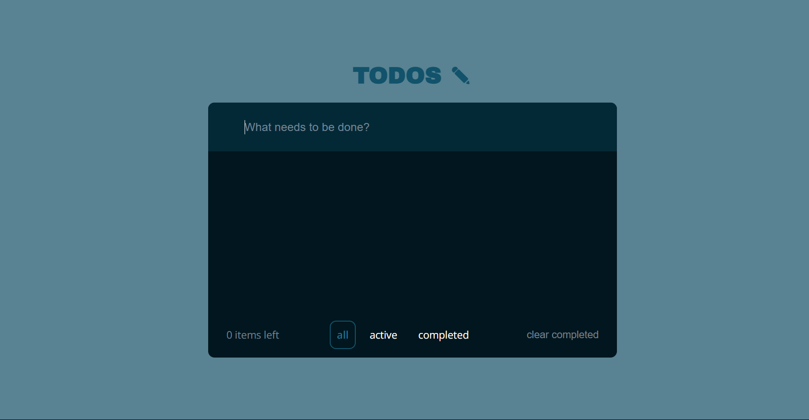

# SIMPLE TO-DO LIST

I used here *React*, *Vite* and *TypeScrypt*. 

### You can:
1. Create your tasks
2. Complete them 
3. Sort them
4. Delete completed ones
5. See how many of tasks are left

:)

